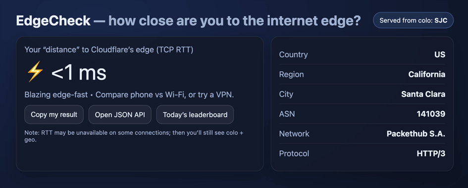

# EdgeCheck

A Cloudflare Worker that measures and displays edge latency (RTT) from your location to Cloudflare's global network. It provides real-time insights into your connection speed to the nearest edge server, along with location data and performance statistics.



## What this project shows

- Workers routing
- Geo (request.cf)
- Stats (Workers KV ~~Durable Objects~~)
- Edge caching
- On-the-fly image generation

## Features

- **Real-time Latency Measurement**: Measures round-trip time (RTT) to Cloudflare's edge servers
- **Location Detection**: Displays your approximate location (country, city, data center)
- **Performance Verdict**: Provides emoji-based feedback on connection speed
- **Statistics Tracking**: Aggregates daily performance data across users
- **Shareable Results**: Copy and share your edge check results
- **On-the-fly Image Generation**: Generates performance summary Open Graph images dynamically, compatible with social media sharing
- **Responsive Design**: Clean, mobile-friendly HTML interface

## Setup

### Prerequisites

- [Node.js](https://nodejs.org/) (version 16 or later)
- [Wrangler CLI](https://developers.cloudflare.com/workers/wrangler/) for Cloudflare Workers

### Installation

1. Clone the repository:

   ```bash
   git clone https://github.com/junior/CloudflareWorkers-edgecheck.git
   cd CloudflareWorkers-edgecheck
   ```

2. Install dependencies:

   ```bash
   npm install
   ```

3. Generate TypeScript types for Cloudflare Workers:

   ```bash
   npm run cf-typegen
   ```

## Usage

### Development

Start the development server:

```bash
npm run dev
```

This will start a local development server at `http://localhost:8787`.

### Testing

Run the test suite:

```bash
npm test
```

## Deployment

Deploy to Cloudflare Workers:

```bash
npm run deploy
```

You'll need to configure a KV namespace named `EDGE_STATS` in your Cloudflare dashboard for storing performance statistics.

### Environment Setup

1. Create a KV namespace in Cloudflare:
   - Go to your Cloudflare dashboard
   - Navigate to Workers > KV
   - Create a new namespace called `EDGE_STATS`

2. Bind the KV namespace to your worker in `wrangler.jsonc`:

   ```json
   {
     "kv_namespaces": [
       {
         "binding": "EDGE_STATS",
         "id": "${EDGE_STATS_KV_ID}"
       }
     ]
   }
   ```

   >Note Replace `${EDGE_STATS_KV_ID}` with your actual KV namespace ID or use the variable `EDGE_STATS_KV_ID` if set in your environment.

## API

The worker responds to GET requests with an HTML page containing:

- Current latency measurement
- Location information (colo, country, city, ASN, network)
- Performance verdict with emoji
- Daily statistics (when available)
- Share functionality

## Contributing

1. Fork the repository
2. Create a feature branch
3. Make your changes
4. Add tests if applicable
5. Run tests: `npm test`
6. Submit a pull request

## License

Licensed under the Apache License, Version 2.0. See [LICENSE](LICENSE) for details.
